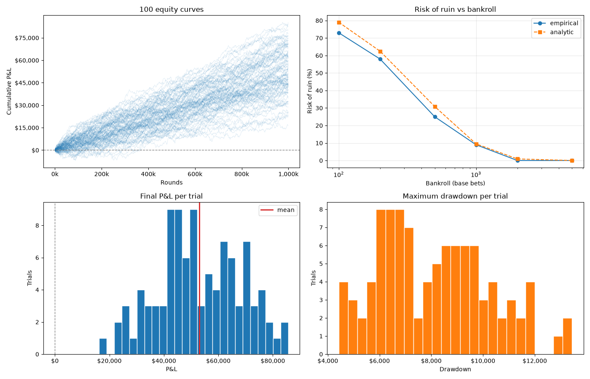

# Blackjack: Simulating a Card Counter's Edge

A from-scratch blackjack engine and Monte Carlo study that measures how much a card counter actually wins and how much variance they have to survive to collect it.

Over 100 independent trials of 1,000,000 rounds each (100M rounds total) with a 1 - 12 unit spread and 5$ units:

| | |
|---|---|
| Edge | **+0.59%** of total wagered |
| EV per round | **$0.053 (0.01 units)** on a $5 base bet (95% CI: $0.050 – $0.056) |
| EV per hour | **$5.31 (1.06 units)** at 100 rounds/hour |
| Standard deviation | $15.02 per round (3.0 units) |
| N0 — rounds until EV equals one SD | **80,088** |
| Bankroll for <1% risk of ruin | **2,000 units** ($10,000 at $5) |

It takes roughly **80,000 hands — about 800 hours of play — before expectation reliably
overtakes the noise.**

---

## The model

A full playable engine. Every round deals
real cards from a real shoe and resolves them under the table rules below.

**Table rules (a typical Vegas 6-deck game):**

| Rule | Setting |
|---|---|
| Decks | 6 |
| Dealer | Hits soft 17 (H17) |
| Blackjack pays | 3:2 |
| Penetration | 75% (reshuffle with 25% of the shoe left) |
| Double after split | Allowed |
| Splitting | Up to 4 hands (3 splits) |
| Split aces | One card each, no resplit |
| Surrender | Late surrender allowed |
| Insurance | Available on a dealer ace |
| Wonging out | Not allowed in simulation but can be toggeled|

All of these are constants at the top of the notebook, so the whole study can be re-run
against a different game (8 decks, 6:5 blackjack, no surrender) by changing one cell.

## The strategy

Three layers, in the order the player applies them:

**1. Basic strategy** — the complete H17 chart, implemented as decision logic rather than a
table: hard totals, soft totals (`aces()`), and pair splitting (`split_logic()`).

**2. The Illustrious 18** — the count-dependent deviations that capture most of the value of
index play. When the true count crosses an index, basic strategy is overridden: standing on
16 vs 10 at TC ≥ 0, taking insurance at TC ≥ 3, doubling 10 vs 10 at TC ≥ 4, splitting 10s
against a 6 at TC ≥ 4, and so on. Deviations that aren't legal in a given spot (doubling with
three cards) silently fall back to basic strategy.

**3. A Hi-Lo bet ramp** — the count is Hi-Lo (+1 on 2–6, 0 on 7–9, −1 on tens and aces), and
the true count is the running count divided by decks remaining. Bets spread 1–12 units:

| True count | Bet |
|---|---|
| < 2 | 1 unit |
| ≥ 2 | 2 units |
| ≥ 3 | 4 units |
| ≥ 4 | 8 units |
| ≥ 5 | 12 units |

The bet is locked in *before* any card of the round is dealt, which is the only legal way to
do it. Average bet across the study came out to $8.71 on a $5 base.

## Results

**Distribution of outcomes across 100 trials of 1M rounds:**

| Percentile | Final P&L |
|---|---|
| 5th | +$25,978 |
| 25th | +$43,338 |
| 50th | +$51,642 |
| 75th | +$64,613 |
| 95th | +$76,600 |
| worst / best | +$16,158 / +$85,632 |

Every trial finished ahead. Over a million rounds the edge is overwhelming — but note the
spread: the luckiest run made five times the unluckiest, from identical strategy.

**Maximum drawdown within a trial** — median $8,006 (1,601 base bets), 95th percentile
$11,811, worst $13,440. Even a guaranteed-winning strategy spends part of its life deeply
underwater.

**Risk of ruin**, by bankroll:

| Bankroll | Empirical | Analytic |
|---|---|---|
| 100 units ($500) | 73% | 79.0% |
| 200 units ($1,000) | 58% | 62.5% |
| 500 units ($2,500) | 25% | 30.9% |
| 1,000 units ($5,000) | 9% | 9.5% |
| 2,000 units ($10,000) | <1% | 0.9% |
| 5,000 units ($25,000) | <1% | 0.0% |

The empirical column counts trials whose equity ever dipped below −B. The analytic column is
the standard random-walk approximation exp(−2μB/σ²), included as an independent cross-check —
the two agree closely, which is good evidence the simulation isn't quietly broken.

**The apparent contradiction is the point.** Zero trials finished down, yet 73% of them would
have busted a 100-unit bankroll along the way. Both are true: with a positive edge you win
*eventually*, but "eventually" is far enough away that undercapitalization kills you first.
The edge decides where you end up; the variance decides whether you're still there to see it.

## Notes on the implementation

**Why a Monte Carlo harness instead of one long run.** A single 1M-hand run gives you one
number with no error bars, and no way to tell an edge from a lucky streak. Running 100
independent trials turns every headline figure into a distribution: the EV gets a confidence
interval, the drawdown gets percentiles, and risk of ruin can be measured empirically rather
than assumed from a formula.

**State handling.** The engine keeps its state in module-level globals, which is the notebook's
main structural compromise. `reset_session()` exists specifically to defuse it — without a full
reset between trials, counters accumulate and each trial contaminates the next. Every trial
starts from a verified-clean slate.

**Deriving risk of ruin after the fact.** Trials run the full horizon without stopping at
bankruptcy. Because the bet ramp depends only on the true count and never on the bankroll,
the P&L path is independent of the starting stake — so recording each trial's minimum equity
lets risk of ruin be computed for *any* bankroll afterward, from one set of runs.

**Performance.** Equity samples are collected into a list and converted to a DataFrame once at
the end; building it with `pd.concat` in the loop measured ~213× slower.

## Limitations

This models a player, not a casino floor. Specifically it assumes:

- **Perfect play** — no counting errors, no fatigue, no missed index plays
- **No countermeasures** — no backoffs, no shuffling-up on a big bet, no barring
- **Flat-out betting** — the 1–12 spread is played openly; real counters need cover
- **No wonging in** — Wonging out can be toggeled in the simulation but is treated as leaving a low count table and moving to a table with a new shoe.
- **A single player, heads-up** — no other players at the table, and no cut-card effects
  beyond fixed penetration

Real-world results would be meaningfully worse. Treat the +0.59% as a clean upper bound on
what this strategy is worth against this rule set.

## Files

- `blackjack.ipynb` — the whole project: engine, strategy, Monte Carlo harness, and analysis

---

MIT licensed. Built as a self-contained study of variance and expectation in a game where
both are precisely knowable.